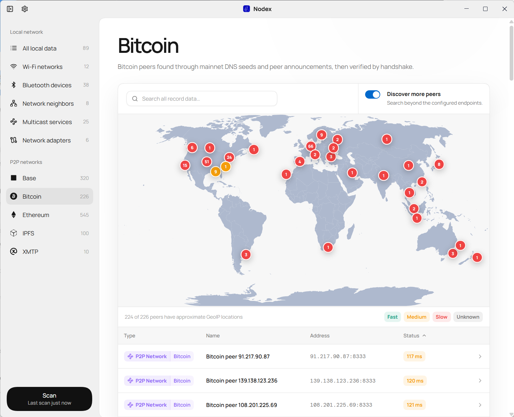
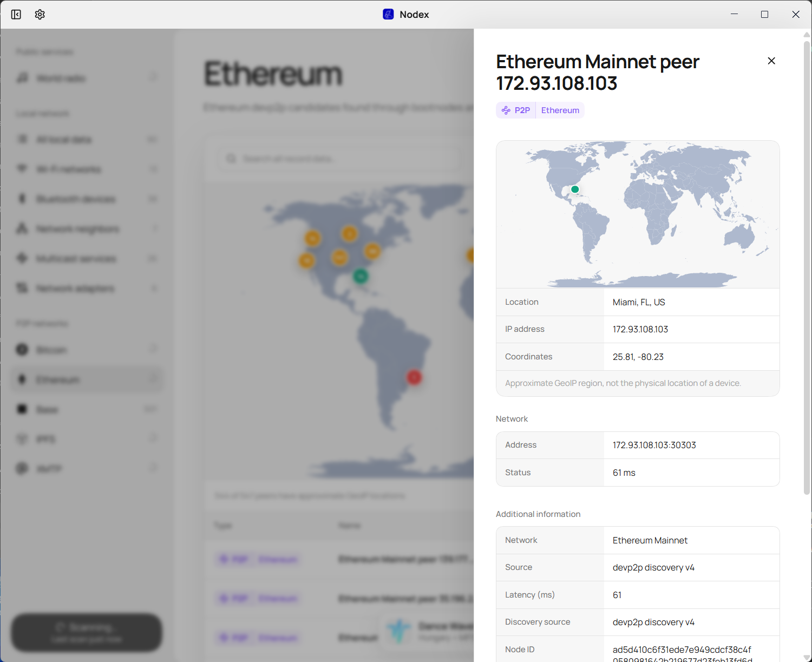
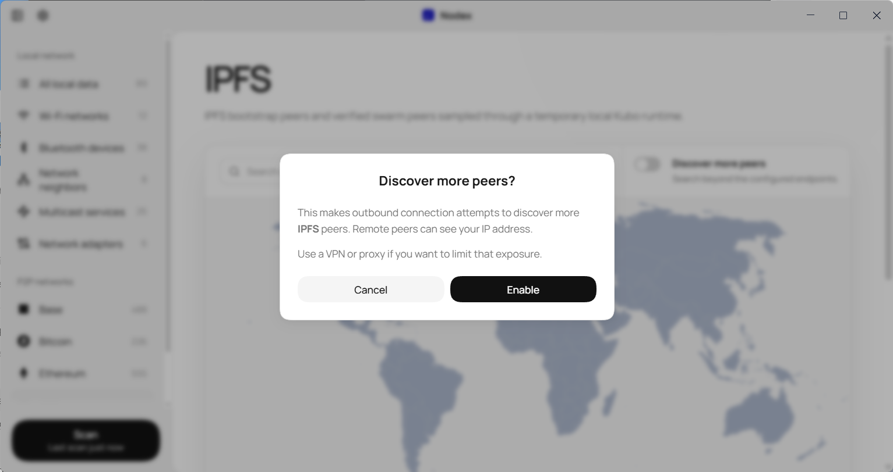
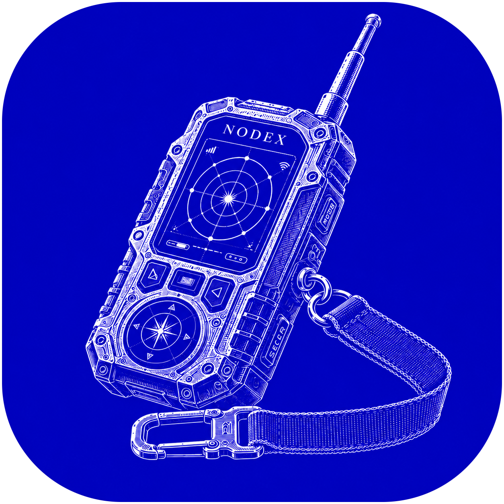

# Nodex

Nodex is a local Windows desktop dashboard for inspecting nearby wireless and network information, plus publicly reachable peers on Bitcoin, Ethereum, Base, IPFS, and XMTP networks.

Nodex is an independent Electron-based engineering project for gaining practical experience with Electron, Windows and local networking, P2P protocols, and desktop UI engineering.

The project could also grow into broader network-observation experiments: a decentralized peer-discovery network that helps map other P2P networks and their reachable nodes, signal-localization tools for estimating where nearby devices or radio sources are coming from, and Wi-Fi sensing experiments that detect presence or movement from changes in wireless signals.

<p align="center">
  
</p>

<p align="center">
  
</p>

<p align="center">
  
</p>

## What it does

- Lists nearby Wi-Fi networks from the Windows wireless interface.
- Shows Bluetooth devices known to Windows, network-neighbor cache entries,
  multicast protocols, and installed network adapters.
- Provides searchable, sortable tables, a GeoIP peer map, live scan progress,
  JSON export, and light/dark/system themes.
- Supports Windows actions for Wi-Fi, Bluetooth, neighbors, and network
  adapters where Windows permissions allow them.
- Queries public P2P network endpoints for Bitcoin, Ethereum, Base, IPFS, and
  XMTP. Bitcoin, Ethereum, Base, and IPFS offer opt-in expanded discovery.

## P2P discovery and validation

Nodex uses the protocol and discovery mechanism appropriate to each network.
Expanded discovery is optional because it makes outbound requests that can reveal
your IP address and timing to DNS operators and remote peers.

| Network | Known scan | Expanded discovery | What a displayed peer proves |
| --- | --- | --- | --- |
| Bitcoin | Bitcoin Core DNS seeds | DNS seeds and peer `addr` announcements | A Bitcoin version/verack handshake completed |
| Ethereum | Official go-ethereum bootnodes | Public devp2p discovery v4 | Discovery and TCP reachability, not chain membership |
| Base | Published Base bootnodes | Public devp2p discovery v4 | Discovery and TCP reachability, not chain membership |
| IPFS | Four configured Kubo bootstrap peers | Bootstrap connection, Amino DHT query, and candidate dialing | Bootstrap reachability or an active Kubo swarm connection |
| XMTP | Curated public Testnet operator endpoints | Not available | DNS and TCP reachability only |

Peers are streamed into the table as they are found. Expanded collectors keep a
bounded in-memory inventory of recently verified peers so a refresh does not
clear the table before the next pass has results. The inventory is not written
to disk and is lost when the app exits.

IPFS discovery uses an isolated temporary Kubo runtime with a loopback-only
API, no gateway or inbound swarm listeners, and telemetry and local mDNS
disabled. Its temporary repository is deleted after each scan.

## Privacy and security

Nodex does not collect, emit, save, or transmit analytics, telemetry,
crash reports, scan history, or identifiers. Scan results remain in memory on
your computer unless you explicitly export JSON or use a Windows action.

The app does not capture packet contents, inject traffic, deauthenticate
clients, join blockchain consensus, or open P2P listening ports. P2P scans make
outbound DNS queries and connection attempts only. They are not anonymous; use
an appropriately configured VPN or proxy if that matters for your threat model.

This is an inspection tool, not a security scanner. A reachable endpoint or
protocol response does not establish trust, ownership, safety, or membership in
a particular blockchain without the additional protocol validation described
above.

## Requirements

- Windows 10 or Windows 11
- [Bun](https://bun.sh/)

The IPFS runtime is bundled through the project dependencies; a separate Kubo
or IPFS installation is not required. Some Windows actions require elevation or
administrator permission.

## Development

```powershell
bun install
bun run dev
```

```powershell
bun test
bun run lint
bun run build
bun run package
```

`bun run package` creates a Windows NSIS installer.
For GitHub Releases, the installer is built by the Windows GitHub Actions
workflow and uploaded as a release asset. The repo itself only contains source
code and build scripts, not the generated `.exe`.

To publish a release:

1. Update `package.json` version if needed.
2. Create and push a tag such as `v0.1.0`.
3. GitHub Actions builds the Windows installer and attaches it to the GitHub
   Releases page.

Download the `.exe` from the release assets. The installer is named like
`Nodex-0.1.3-win-x64.exe`.

## Project structure

- `src/` — React renderer, views, state, shared UI components, and styles.
- `electron/` — Electron main process, IPC, Windows collectors, and actions.
- `electron/p2p/` — P2P collector contract, settings, DNS helpers, discovery
  primitives, and protocol-specific collectors.
- `electron/p2p/collectors/` — One collector per supported P2P network.
- `scripts/` — Build-time utilities.
- `public/` — Static renderer assets.

## Limitations

- Bluetooth is Windows device inventory, not live BLE advertisement capture.
- Standard consumer adapters cannot observe cellular, Zigbee, Z-Wave, LoRa,
  NFC, satellite, or general RF traffic.
- Public bootnodes and DHTs are discovery inputs, not exhaustive peer lists.
- XMTP has no general public peer-discovery protocol, so it intentionally uses
  a curated operator inventory.

## License

[MIT](LICENSE)

<p align="center">
  
</p>
